# Automated CI/CD Pipeline for Node.js Application Deployment on OpenShift

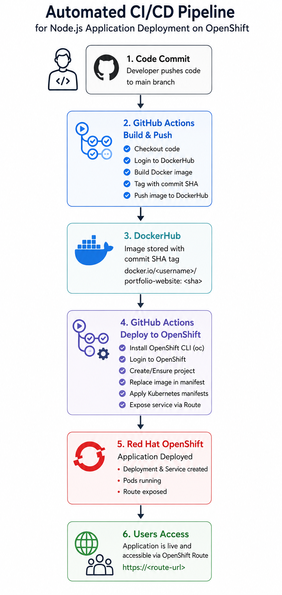

This project outlines the step-by-step process of setting up a
Continuous Integration and Continuous Deployment (CI/CD) pipeline for a
Node.js application. The pipeline uses **GitHub Actions** to build a
Docker image, push it to **DockerHub**, and deploy it to a **Red Hat
OpenShift Cluster**.

## 1. Overview and Architecture

The pipeline is triggered automatically whenever code is pushed to the
main branch. It consists of two primary jobs:

1.  **Build and Push:** Checks out the source code, logs into DockerHub,
    builds a Docker image from the provided Dockerfile, tags it with a
    unique commit SHA, and pushes it to DockerHub.

2.  **Deploy to OpenShift:** Installs the OpenShift CLI (oc),
    authenticates with the OpenShift cluster, replaces the image
    placeholder in the deployment manifest with the newly built image
    tag, applies the configurations, and exposes a route for public
    access.

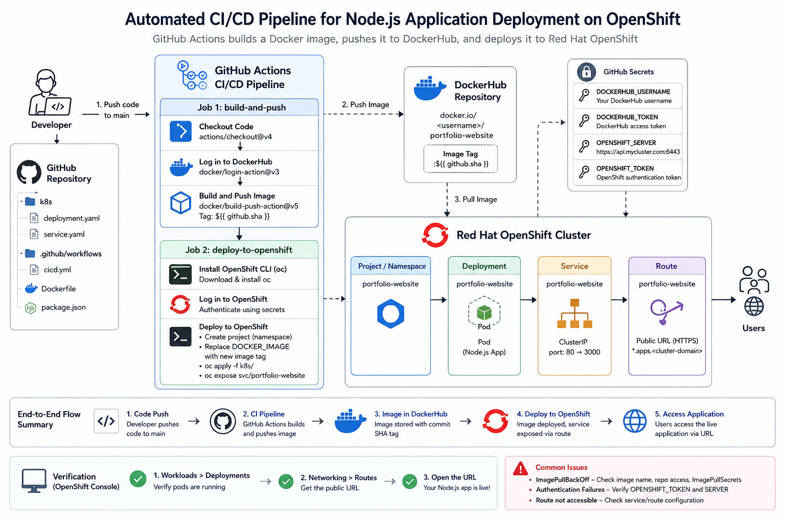

## 

## 

## 2. Prerequisites

Before setting up this pipeline, ensure you have the following:

- **GitHub Repository:** Containing your Node.js application code and a
  valid Dockerfile at the root.

- **DockerHub Account:** To store your container images.

- **OpenShift Cluster Access:** A running OpenShift cluster with an API
  server URL and an authentication token (preferably a ServiceAccount
  token with namespace admin privileges).

## Step 1: Configure GitHub Secrets

For the pipeline to securely interact with DockerHub and OpenShift, you
need to configure repository secrets in GitHub.

First Get login credential tokens from redhat openshift

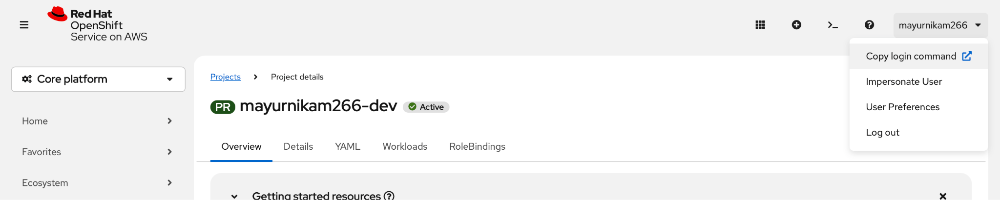

Copy tokens api and login tokens

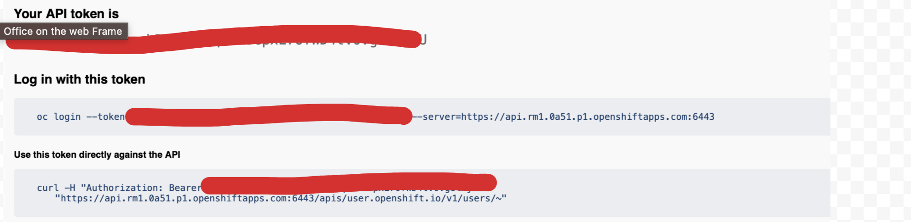

Copying Dockerhub Tokens:

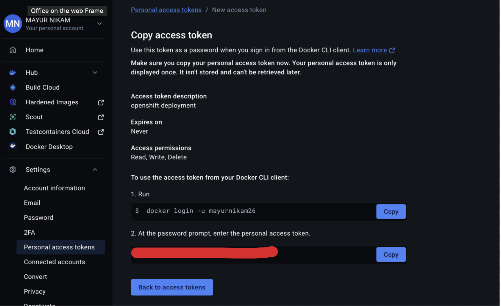

In github repository **Settings \> Secrets and variables \> Actions \>
New repository secret** and adding secrets for security

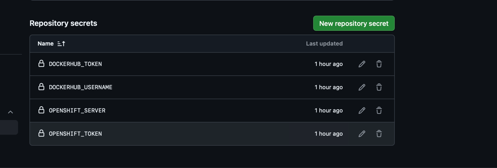

| **Secret Name** | **Description** |
|----|----|
| DOCKERHUB_USERNAME | DockerHub username |
| DOCKERHUB_TOKEN | DockerHub Access Token (or password). |
| OPENSHIFT_SERVER | The API URL of OpenShift cluster |
| OPENSHIFT_TOKEN | A valid authentication token for the OpenShift cluster. |

##  Step 2: Prepare Kubernetes Manifests

Create a directory named k8s in the root of your repository and place
the following YAML files inside it.

### k8s/deployment.yaml

This file defines the Deployment for your application. DOCKER_IMAGE
placeholder; this will be dynamically replaced by the pipeline during
deployment.

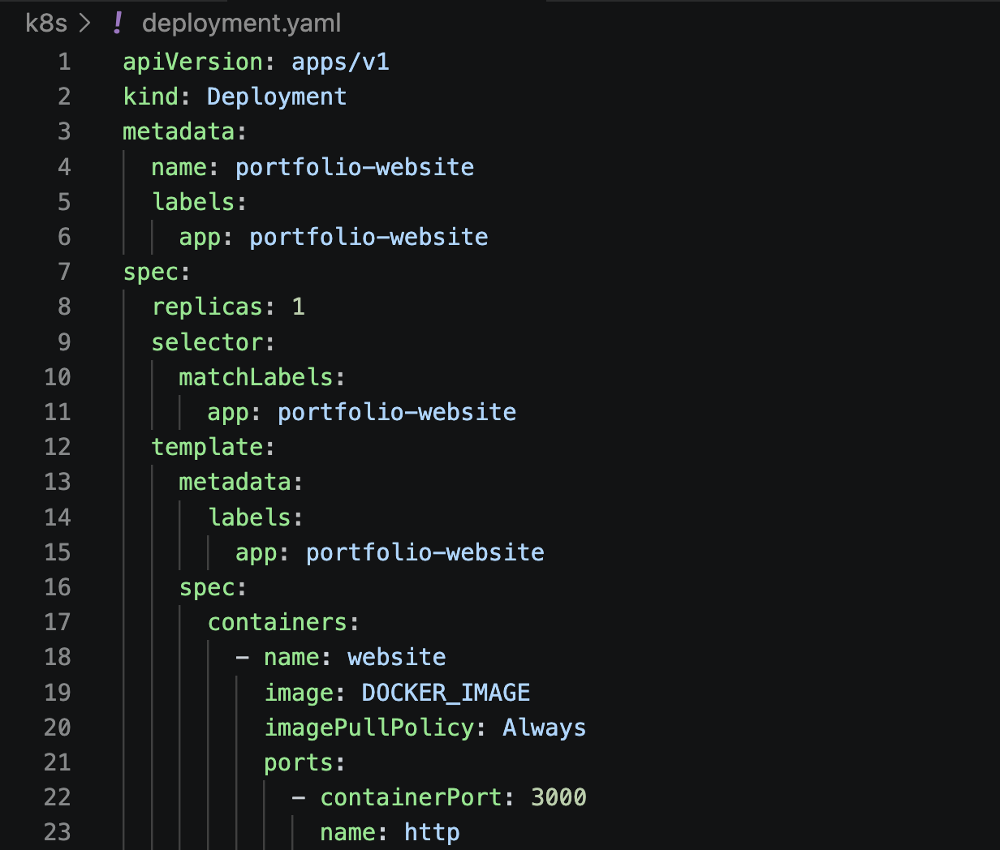

### k8s/service.yaml

This file defines the internal Service to route traffic to your
deployment pods.

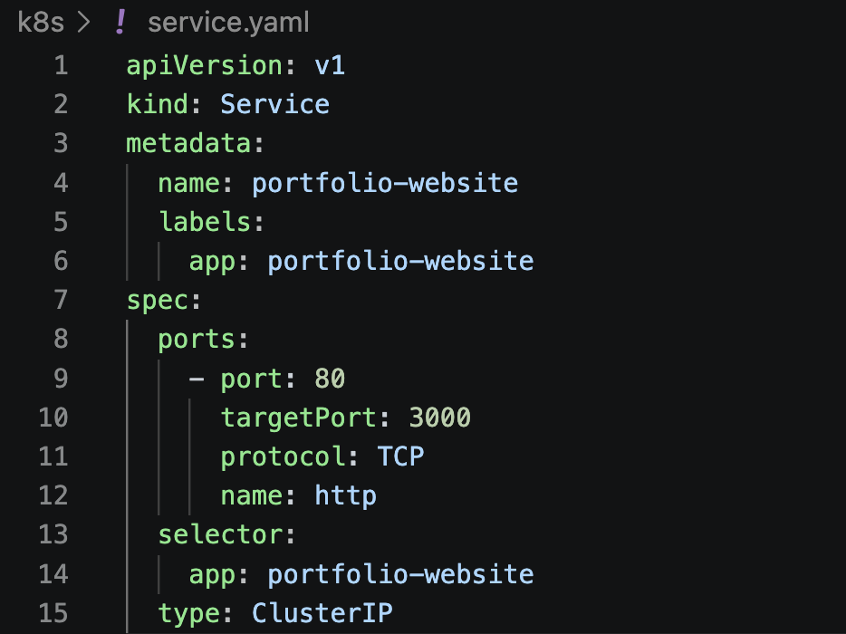

## 

## 

## 

## 

## 

## 

##  Step 3: Setup GitHub Actions Workflow

Created a directory path .github/workflows/ in the root of your
repository and create a file named cicd.yml (
.github/workflows/cicd.yml). Add the following pipeline configuration:

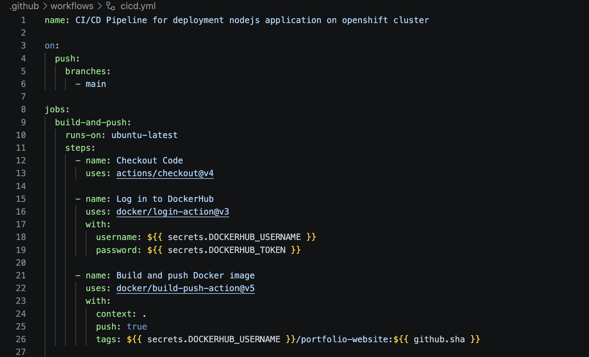

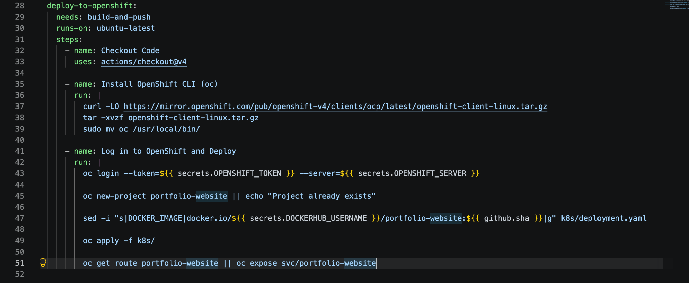

## 

##  Workflow Breakdown

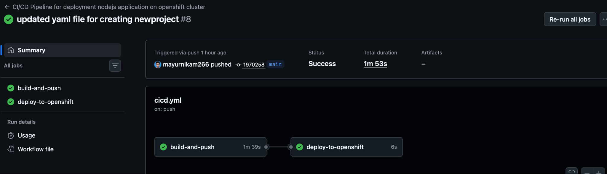

### Job 1: build-and-push

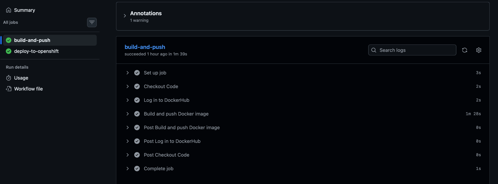

- **Checkout Code:** Pulls the latest code from the main branch.

- **Log in to DockerHub:** Authenticates using the configured GitHub
  secrets.

- **Build and Push:** Uses standard Docker actions to build the image.
  It securely tags the image using \${{ github.sha }} (the unique commit
  ID), ensuring traceability and preventing version collisions, before
  pushing it to DockerHub.

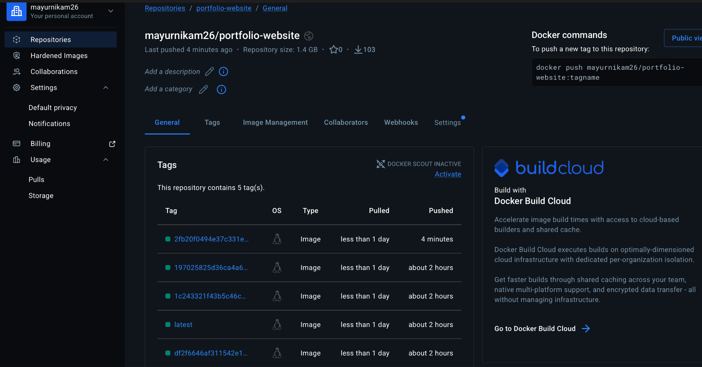

### Job 2: deploy-to-openshift

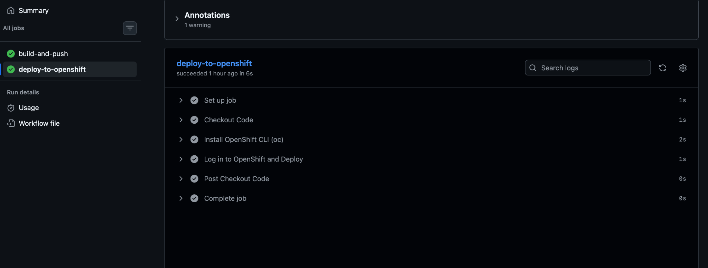

- **Needs:** Waits for the build-and-push job to finish successfully
  before starting.

- **Install OpenShift CLI:** Downloads and installs the latest oc client
  required to interact with your OpenShift cluster.

- **Deployment Script Logic:**

  1.  Logs into the OpenShift cluster securely.

  2.  Attempts to create the portfolio-website namespace/project. If it
      already exists, it continues gracefully (\|\| echo).

  3.  Uses the sed (stream editor) command to dynamically find the
      string DOCKER_IMAGE in k8s/deployment.yaml and replace it with the
      exact DockerHub image URL and commit SHA that was just built.

  4.  Runs oc apply -f k8s/ to apply both the Deployment and the
      Service. OpenShift will automatically trigger a rolling update to
      the new image.

  5.  Runs oc expose svc/portfolio-website to create an OpenShift Route,
      providing an external public URL for your web application.

##  Verification 

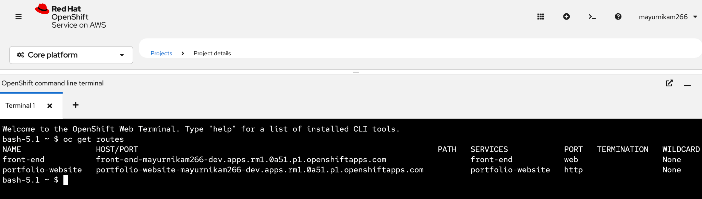

Is successfully exposed route .

Note: Now i am changing in code instead of Mayur Dayaram Nikam I am
adding Mayur D Nikam and verifying is it pushing automatically or not ?

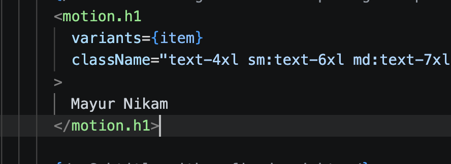

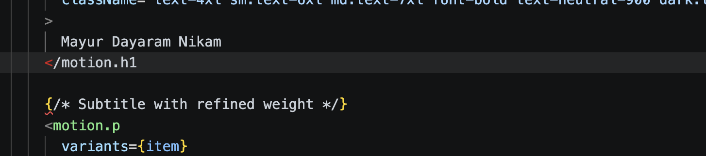

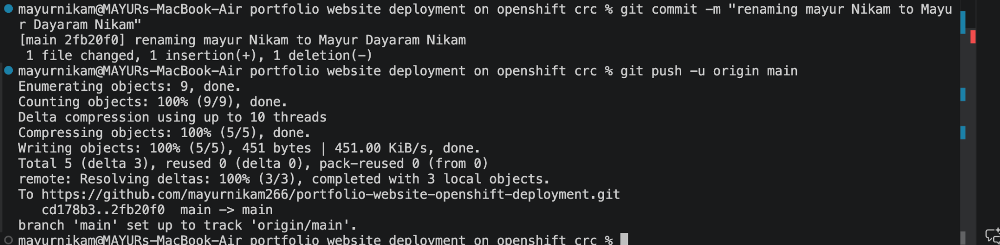

Now you can see updated Frontend after cicd running successfully

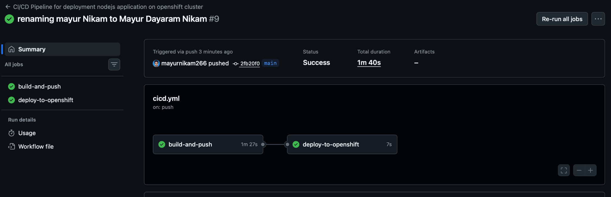

